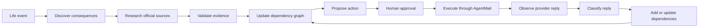
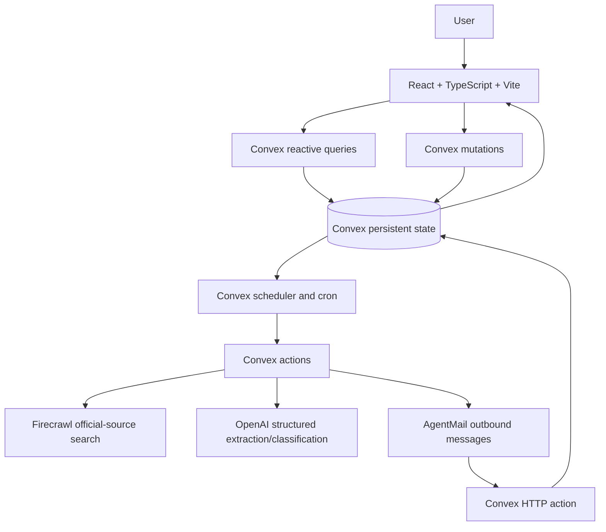
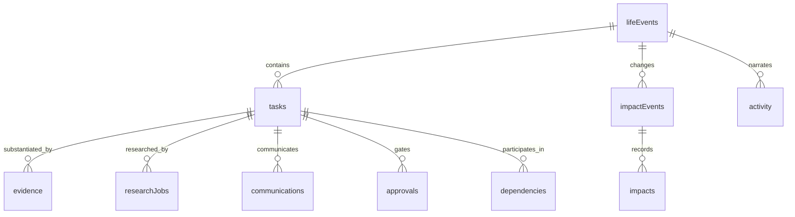

# MOVEOS

## Tell us you’re moving. We’ll handle what changes.

MOVEOS is an AI-powered relocation operating system. It turns a move into a living operational plan: discover consequences, research applicable requirements, validate evidence, coordinate actions, observe replies, and adapt when the move changes.

> A move is not a checklist. It is a dependency graph that keeps changing.

**Live demo:** [groovy-cricket-986.convex.site](https://groovy-cricket-986.convex.site)
**Convex production deployment:** `groovy-cricket-986.convex.cloud`
**Hackathon:** Convex All Gas Hackathon

## The problem

Moving city or country changes many connected systems at once: housing, utilities, broadband, banking, insurance, healthcare, education, employment, government records, transport, subscriptions, family arrangements, and—when crossing a border—travel documents, customs, immigration, and tax administration.

A static checklist makes the person discover these consequences manually, research many sites, remember dependencies, contact organisations, and recover when a provider says “that transfer is unavailable.” MOVEOS keeps the move as a live operational state instead.

## The MOVEOS idea



The checklist is only the visible surface. The useful unit is a task with geography, applicability, evidence, dependencies, and a next action.

## What makes MOVEOS different

### Living dependency graph

Convex stores tasks, dependencies, communications, approvals, impacts, and activity as persistent state. The UI subscribes to that state and renders the current operation rather than a one-time generated list.

### Impact Cascade

When a root fact changes—such as the move date, origin, destination, or household context—MOVEOS compares canonical values before writing. A real change creates one impact event, identifies affected task scopes, invalidates context-bound evidence, and queues only eligible research. National evidence can survive a city change when its source was explicitly validated as national; city-specific evidence becomes historical.

Repeating the same canonical value is a no-op: it creates no version bump, impact event, activity event, invalidation, or research job.

### Real-world feedback loop

An approved task can send a message through AgentMail. An inbound `message.received` event reaches the Convex HTTP action, is deduplicated by external event ID, persisted, and classified with structured OpenAI output. Provider replies can change task state and create idempotent downstream work. For example, an unavailable broadband transfer can lead to cancellation, termination-fee review, and finding a destination provider.

### Geographic grounding

Locations are normalized into city, region, country, and country code. The move is classified as domestic, international, or unresolved. Research queries include the relevant origin, destination, country, provider, and task scope; research is blocked until required geography is resolved.

### Graceful research degradation

The deterministic baseline is created before Firecrawl or OpenAI is called. Provider-specific work asks for missing context rather than inventing a provider. Firecrawl failures, rate limits, timeouts, and incomplete model outputs update research status and next action while leaving the checklist present and actionable.

## Domestic relocation

For **Hyderabad, Telangana, India → Pune, Maharashtra, India**, the baseline considers 17 operational domains:

- housing and moving logistics
- electricity, water/gas utilities, broadband, and telecom
- financial accounts, insurance, employment/payroll, and government records
- healthcare, education, family/child arrangements, and address changes
- transport/vehicle, subscriptions/deliveries, and important documents

These are operational considerations, not a claim that every item is legally required for every household. Child-specific education is represented separately from healthcare and is automatically applicable when a child is reported.

## International relocation

For **Hyderabad, India → London, United Kingdom**, MOVEOS adds international domains for:

- immigration and right-to-reside considerations
- travel documents and dependent documentation
- customs and household goods
- travel and arrival planning
- cross-border finance
- tax and destination registration

MOVEOS organises and researches a workflow; it is not a substitute for legal, immigration, tax, medical, or other professional advice.

## Human-in-the-loop actions

Research and evidence do not silently authorise consequential actions. The intended path is:

```text
research → evidence → proposed action → human approval → AgentMail execution
```

Non-demo sends require an approved task, complete recipient/draft data, current verified evidence, and usable AgentMail message and thread IDs. Demo mode never sends external mail.

## Evidence and trust

Evidence records retain the source URL/title, excerpt, extracted requirement, authority, geographic relevance, task relevance, user-role relevance, retrieval time, context version, geographic scope, and a move/task context snapshot.

The dashboard’s **Verified** metric counts only current evidence that passes backend applicability checks. Stale, superseded, rejected, secondary, needs-verification, context-mismatched, or role-irrelevant evidence is excluded from active evidence and metrics but can remain in history.

Official-domain status alone is not enough. A landlord-oriented GOV.UK source, for example, is not accepted as tenant housing evidence merely because the domain is official.

## Architecture



`convex/http.ts` keeps the AgentMail webhook at `/agentmail/webhook` and mounts the static-hosting catch-all after application routes. `convex/convex.config.ts` registers `@convex-dev/migrations` and `@convex-dev/static-hosting`.

## Why Convex is central

MOVEOS uses Convex as the operational state layer, not merely as a database:

- `defineSchema` models moves, tasks, dependencies, evidence, jobs, communications, approvals, impacts, activity, and webhook deduplication.
- Indexed queries feed the live dashboard and bounded backend reads.
- Mutations create moves, reconcile baselines, apply context changes, enqueue jobs, save evidence, process replies, and enforce approval guards.
- Actions call Firecrawl, OpenAI, and AgentMail from the server-side runtime.
- Scheduled functions claim research jobs, retry rate-limited work, recover leases, and run conservative approval reminders.
- HTTP actions receive secret-header-authenticated AgentMail events.
- Reactive `useQuery` subscriptions keep the dashboard, evidence, impact list, task statuses, and activity timeline synchronized.
- The migrations component provides resumable repair of older partial move data.

## Sponsor and AI stack

| Technology | Role in MOVEOS |
|---|---|
| Convex | Persistent operational state, schema, indexes, queries, mutations, actions, scheduler, cron, HTTP actions, and realtime subscriptions. |
| OpenAI | Structured consequence discovery compatibility, official-source requirement extraction, and provider-reply classification using `gpt-5.6-luna`. |
| Firecrawl | Server-side search and retrieval of candidate official sources. |
| AgentMail | Approval-gated outbound provider messages and inbound reply delivery. |
| React / TypeScript / Vite | The live command-center dashboard and move creation flow. |

## Data and state model

The primary Convex tables are:

| Table | Purpose |
|---|---|
| `lifeEvents` | Move context, normalized locations, household, date, type, and context version. |
| `tasks` | Operational work, scope, applicability, provider context, status, and next action. |
| `dependencies` | Relationships between tasks and their conditions. |
| `evidence` | Source-backed requirements and validation/provenance metadata. |
| `researchJobs` | Deduplicated queued, running, retrying, completed, and failed research work. |
| `communications` | Outbound and inbound AgentMail messages. |
| `approvals` | Human approval state for proposed actions. |
| `impactEvents` / `impacts` | Root changes and their affected operations. |
| `activity` | Reactive operational timeline. |
| `webhookEvents` | Idempotency records for inbound external events. |



## Impact Cascade internals

1. A mutation canonicalizes the proposed root context.
2. If it is unchanged, the mutation returns without side effects.
3. If it changed, Convex persists one `impactEvents` record and increments the move context version.
4. Task geographic scope determines whether origin, destination, both, national, or international work is affected.
5. Affected evidence is marked stale or superseded; historical records remain auditable.
6. Equivalent research jobs are deduplicated by task, context version, provider, geography, and research type.
7. The reactive UI receives the new task, impact, evidence, and activity state.

This targeted approach preserves unaffected national work and avoids asking an AI system to regenerate an entire move plan for every small context change.

## Research pipeline

```text
eligible task
  → stable research key and queue claim
  → geographically grounded Firecrawl query
  → official-source screening
  → OpenAI applicability and role validation
  → structured evidence persistence
  → Verified or Needs verification in the reactive UI
```

Research states include `QUEUED`, `SEARCHING`, `VERIFIED`, `NEEDS_INFORMATION`, `NEEDS_VERIFICATION`, `RETRY_SCHEDULED`, and `RESEARCH_INCOMPLETE`. A worker lease and attempt number prevent stale workers from publishing results after a move changes. HTTP 429 responses use bounded backoff; failed research leaves a manual next action.

## AgentMail workflow

### Outbound

```text
task → proposed draft → human approval → AgentMail send → persisted status
```

The send action reads `AGENTMAIL_API_KEY` and `AGENTMAIL_INBOX_ID` only from Convex deployment environment variables.

### Inbound

```text
AgentMail message.received
  → POST /agentmail/webhook
  → secret-header verification
  → payload validation
  → webhook-event deduplication
  → communication persistence
  → OpenAI reply classification
  → task/dependency update
```

The deployed webhook is:

```text
https://<your-convex-site>/agentmail/webhook
```

For this deployment it is `https://groovy-cricket-986.convex.site/agentmail/webhook`. AgentMail must send the `message.received` event with the custom `x-moveos-webhook-secret` header matching the Convex `AGENTMAIL_WEBHOOK_SECRET` value.

## Example journey: Hyderabad → London

1. The user creates a move for Hyderabad to London, with date and household.
2. MOVEOS normalizes both locations and classifies the move as international.
3. The deterministic baseline and international domains appear immediately.
4. Eligible research is queued automatically; provider-specific gaps become explicit questions.
5. Candidate official sources are screened for geography, task relevance, and resident/tenant role before evidence can count as verified.
6. Dependencies and research status update in the live dashboard.
7. A user reviews and approves any consequential external action.
8. AgentMail delivers the message; a provider reply returns through the signed webhook.
9. The reply is deduplicated, stored, classified, and may create downstream operations.
10. If the user changes the destination or date, one targeted Impact Cascade identifies what must be reconsidered while preserving applicable work.

## Local setup

### Prerequisites

- Node.js with npm
- A Convex account for cloud deployment, or the anonymous local Convex runtime
- API credentials for any external research or mail actions you want to run

### Install

```bash
git clone https://github.com/Manikant92/MoveOS.git
cd MoveOS
npm install
```

### Configure the frontend

Create `.env.local` with the URL of the active Convex deployment:

```dotenv
VITE_CONVEX_URL=http://127.0.0.1:3210
```

Do not put server secrets in `.env.local` when they are intended for Convex actions. The checked-in `.env.example` contains names only.

### Run locally

In one terminal:

```bash
npx convex dev
```

In another:

```bash
npm run dev
```

Open the Vite URL printed by the dev server, normally `http://127.0.0.1:5173`.

### Test and build

```bash
npm test
npm run build
npx tsc --noEmit -p convex/tsconfig.json
```

The test suite includes the existing workflow guards and Convex in-memory acceptance tests for location resolution, baselines, child-specific domains, stale evidence, national scope, no-op changes, research deduplication, needs-information, queue failure/retry behavior, international tasks, landlord-role rejection, late-worker fencing, and approval evidence guards.

## Environment variables

Set server values on the Convex deployment with `npx convex env set`, not in the browser bundle:

| Variable | Where | Purpose |
|---|---|---|
| `OPENAI_API_KEY` | Convex secret | Structured discovery compatibility and reply/source classification. |
| `FIRECRAWL_API_KEY` | Convex secret | Official-source search and retrieval. |
| `AGENTMAIL_API_KEY` | Convex secret | Approved outbound AgentMail sends. |
| `AGENTMAIL_INBOX_ID` | Convex secret | AgentMail inbox used by outbound sends. |
| `AGENTMAIL_WEBHOOK_SECRET` | Convex secret | Shared header secret for inbound webhook verification. |
| `VITE_CONVEX_URL` | Vite client config | Convex client URL; safe to embed in the frontend. |

Example:

```bash
npx convex env set OPENAI_API_KEY "<server-secret>"
npx convex env set FIRECRAWL_API_KEY "<server-secret>"
npx convex env set AGENTMAIL_API_KEY "<server-secret>"
npx convex env set AGENTMAIL_INBOX_ID "<inbox-id>"
npx convex env set AGENTMAIL_WEBHOOK_SECRET "<webhook-secret>"
```

Never commit `.env`, `.env.local`, deployment credentials, or API keys.

## Deployment

The production frontend uses Convex static hosting and the backend is deployed to the project’s production Convex deployment.

```bash
npx convex login
npm run deploy
```

`npm run deploy` runs `@convex-dev/static-hosting deploy`: it builds the Vite `dist/` directory with the production `VITE_CONVEX_URL`, deploys Convex functions and components, and uploads the static files. The current live deployment is:

- Frontend: [groovy-cricket-986.convex.site](https://groovy-cricket-986.convex.site)
- Backend: `https://groovy-cricket-986.convex.cloud`

After deployment, configure AgentMail’s `message.received` webhook to the production `/agentmail/webhook` route and set the matching `AGENTMAIL_WEBHOOK_SECRET` in Convex.

## Reliability and safety

- Consequential external actions require human approval and current verified evidence.
- OpenAI responses are parsed against structured schemas before persistence.
- Evidence is tied to task, provider, geography, role, scope, and context version; stale context cannot publish a result.
- Research jobs have stable deduplication keys, leases, bounded retries, and rate-limit handling.
- Unknown providers become actionable questions rather than invented facts.
- AgentMail inbound events are deduplicated by external event ID.
- Demo mode blocks external sends.
- External API failures do not erase the deterministic relocation baseline.
- Secrets are read server-side from Convex environment variables.

## Repository structure

```text
convex/
  schema.ts          Persistent MOVEOS data model and indexes
  operations.ts      Public queries/mutations and operational state changes
  researchModel.ts   Deterministic baselines, evidence rules, reconciliation
  researchQueue.ts   Atomic queue claims, leases, retries, diagnostics
  integrations.ts    Firecrawl, OpenAI, and AgentMail actions
  http.ts            AgentMail webhook and static-hosting route
  migrations.ts      Resumable legacy-data repair
  reminders.ts       Conservative approval reminder cron
src/
  App.tsx            React command-center UI
  styles.css         Product styling
tests/
  phase2.test.ts     Convex acceptance and failure-path tests
  workflow.test.mjs  Pure workflow guard tests
  local-acceptance.mjs  Explicit local deployment smoke checks
PHASE2_ACCEPTANCE.md  Detailed acceptance matrix and measured snapshots
hackathon.md           Evidence-based Convex hackathon build log
```

## Built for the Convex All Gas Hackathon

MOVEOS addresses an everyday problem while using Convex as the live operational backend: the same state powers discovery, evidence, dependencies, approvals, webhooks, scheduled research, and the reactive UI. Convex is part of the product’s coordination model—not just a persistence layer.

## Future direction

Future work could add more relocation providers, deeper destination-service discovery, richer jurisdiction coverage, housing-specific workflows, and additional real-world integrations. These are not required for the current baseline application.

**Tell MOVEOS you’re moving. Let the plan adapt as life changes.**
